# HDFC Digital KYC — Secure Onboarding (Capstone Project)

> A demo end-to-end digital KYC solution prototype built to reduce drop-off and improve conversion during onboarding.  
> Designed & implemented as a capstone submission for the Job-Ready Model program.

---

## Table of contents

- [Project overview](#project-overview)
- [Problem statement](#problem-statement)
- [Solution & approach](#solution--approach)
- [Key features](#key-features)
- [Architecture & data flow](#architecture--data-flow)
- [Demo / Screenshots](#demo--screenshots)
- [How to run (developer)](#how-to-run-developer)
- [GitHub submission (branch submission)](#github-submission-branch-submission)
- [API endpoints (demo)](#api-endpoints-demo)
- [Evaluation mapping to rubric](#evaluation-mapping-to-rubric)
- [Known limitations & future work](#known-limitations--future-work)

## Project overview

This project is a secure, user-friendly digital KYC (Know Your Customer) onboarding flow focused on reducing customer drop-off during identity verification.  
It is implemented as a capstone submission for the **Job-Ready Model** program for HDFC Bank reviewers.

This prototype demonstrates:
- Document upload with OCR-based document validation on the backend.
- Real-time selfie capture and upload from the browser.
- Simple client-side attempt counters and retry flows.
- A small demo backend API surface that simulates validation responses.
- A UX-first approach that combines document validation with face verification to improve completion rates.

## Problem statement

Online account opening often suffers from high drop-offs during the KYC step because:

- Users upload poor-quality or wrong-type documents.
- Browser/device camera flows for selfies are fragile and confusing.
- The UX does not clearly communicate retries, reasons for failures, or what to do next.

This prototype shows how better guidance, clear validation feedback from the server, and transparent retry/reset flows can reduce friction and improve completion rates.

## Solution & approach

The solution provides an intuitive **3-step flow**: **Document → Selfie → Finish**, with clear guidance and feedback at each step.

- The user uploads a document, which is processed on the backend using OCR and validation checks; results are surfaced via a polling status component.
- Selfie capture uses `getUserMedia` for real-time camera access with a fallback to file upload if camera permissions fail.
- The UI tracks the allowed number of attempts for document and selfie steps and exposes a **Reset attempts** control for demo purposes.
- A final success screen summarizes the verification outcomes so both users and reviewers can see how the flow behaves end-to-end.

## Key features

- **Document type selection, upload & preview** for a smooth starting experience.
- **Server-side OCR and validation** with a polling-based status component to show progress.
- **Type-mismatch handling** that suggests changing the selected document type when needed.
- **Selfie capture via `getUserMedia`** with camera toggle (front/back) and a file upload fallback.
- **Attempt counters** for document and selfie steps, plus a **Reset attempts** button for demo testing.
- **Clean, bank-like UI** with a stepper and clear status/error messages to guide users.

## Architecture & data flow

The prototype is split into a lightweight React frontend and a demo backend that simulates typical KYC validation services.

- **Frontend:** React + Vite single-page application that manages the 3-step flow, state, attempt counters, and UI feedback.
- **Backend (demo):** Node.js / Express-style endpoints that accept uploads and return simulated validation status.
- **OCR / service layer:** A service that extracts snippets from uploaded documents and returns confidence, reason codes, and other metadata used to drive UI messages.

### Diagrams

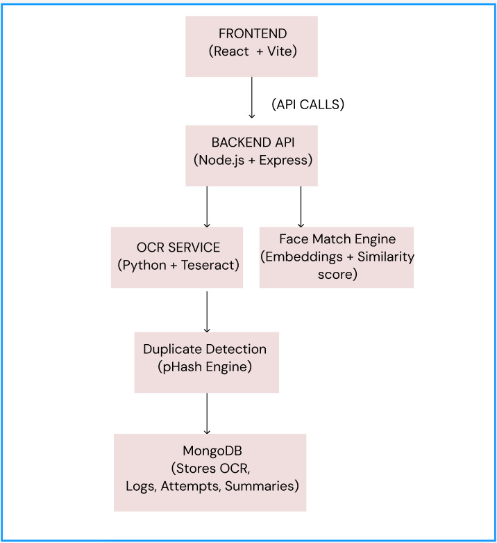  
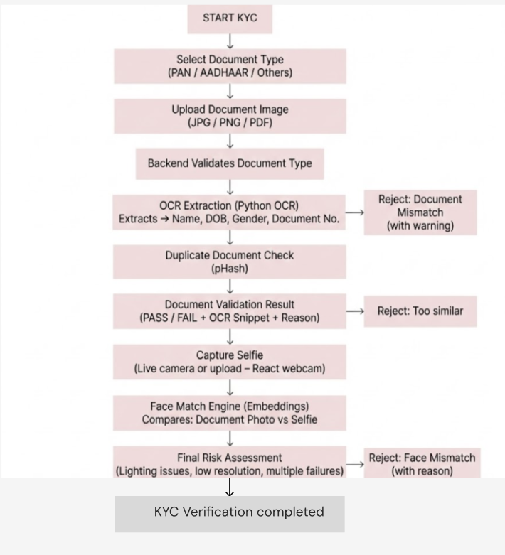

## Demo / Screenshots

Use these screenshots to quickly understand the flow without running the backend.

### Onboarding / Document UI
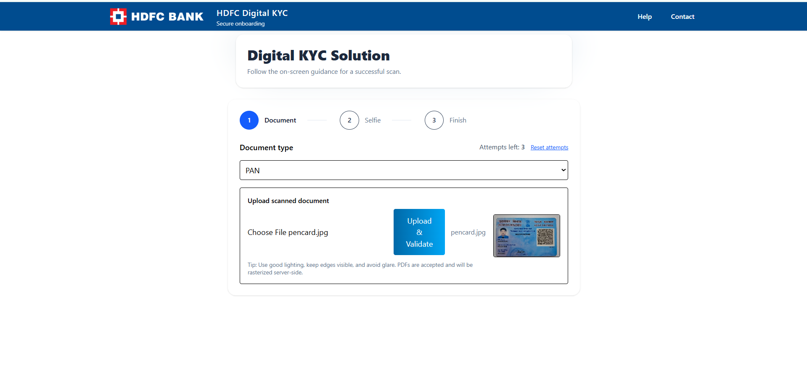
### Validation Status
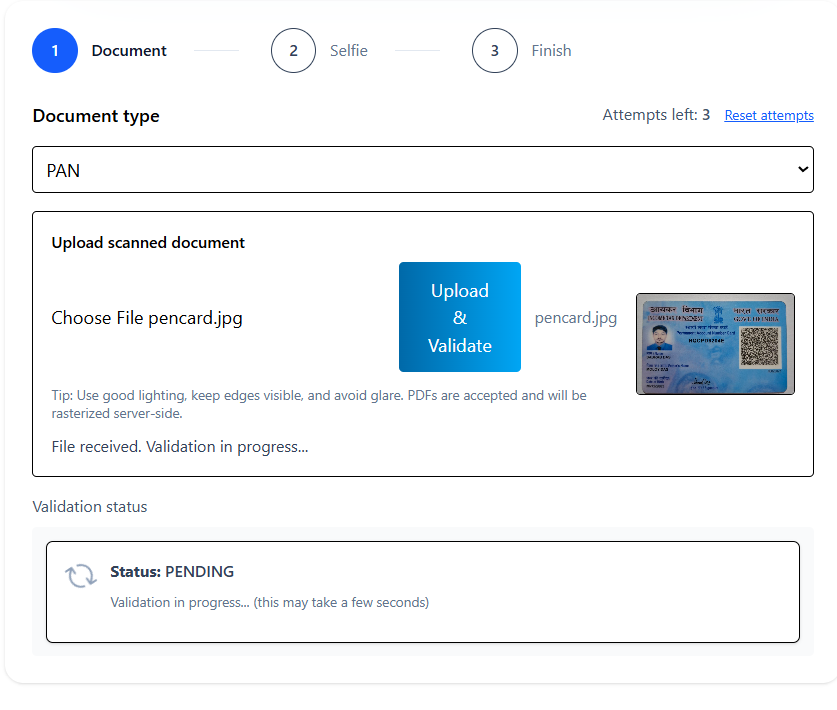

### Duplicate Document Detected
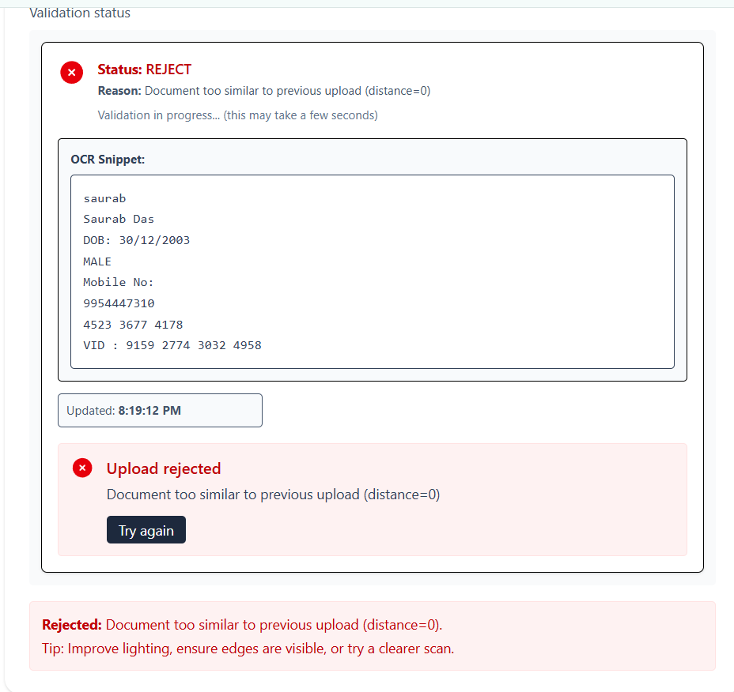

### Document Type Not Matched
### Choosen PAN Uploaded AADHAR
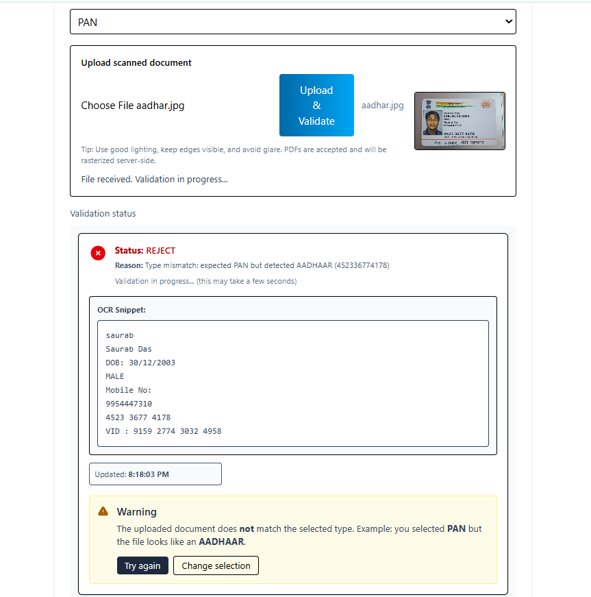

### Selfie UI
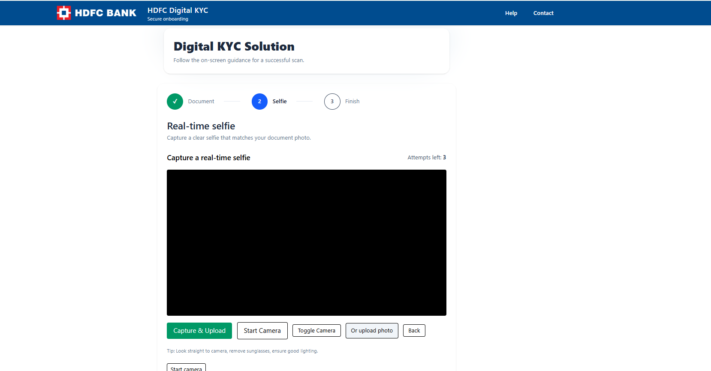

### Error Face Not Matched
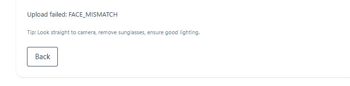

### Guidance Low Resolution 
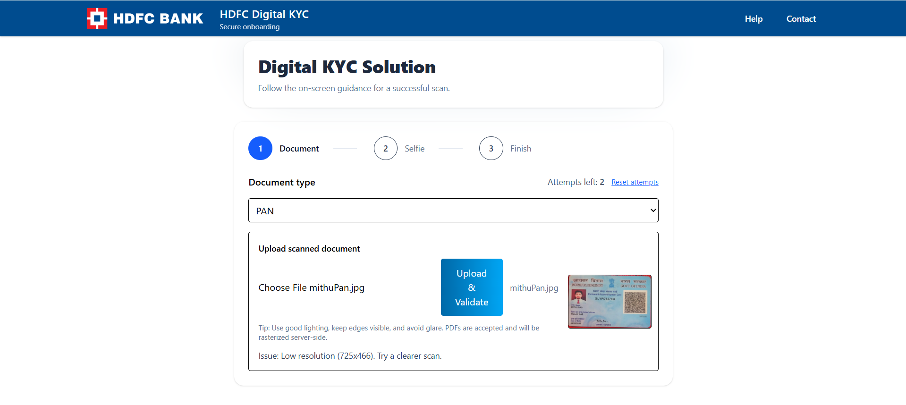
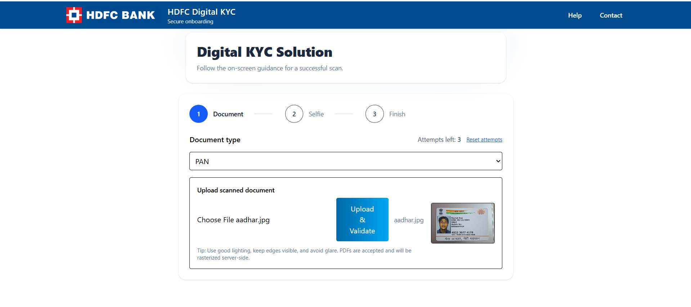

### Success
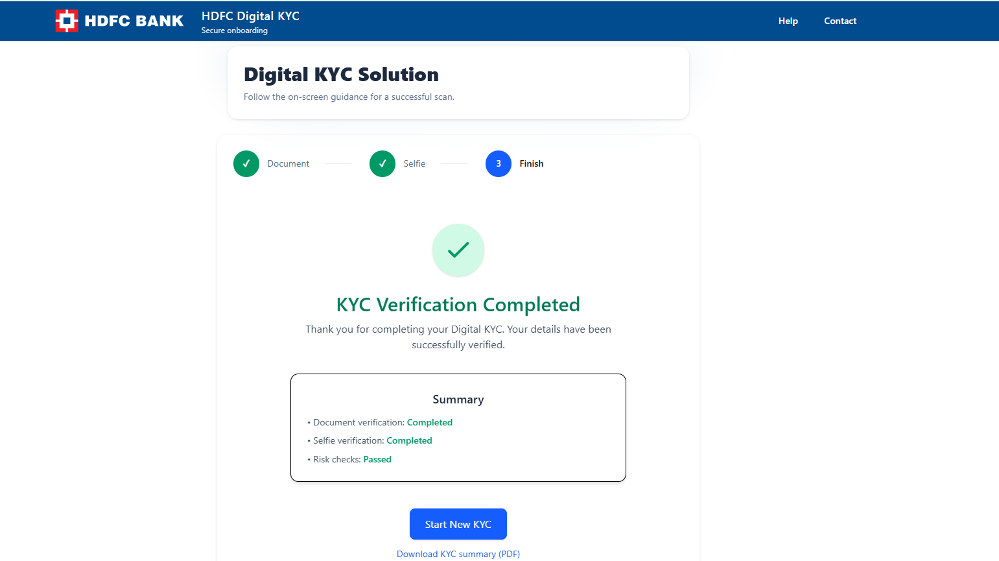

## How to run (developer)

This project has been tested locally with **Node.js**, **npm**, and **Vite**.

### Prerequisites
- Node.js (version 18 or higher recommended)
- npm (version 9 or higher)

### Frontend (Vite)
clone the repository
git clone https://github.com/saurab5095/Digital-KYC-Solution.git
cd "Digital-KYC-Solution/hdfc-capstone-v1/frontend"

install dependencies
npm install

start frontend (Vite)
npm run dev

open http://localhost:5173

### Backend (demo)

If you want to run the included demo backend:
from repo root
cd "Digital-KYC-Solution/hdfc-capstone-v1/backend"
npm install
npm run dev

backend listens on the port configured in /backend

### Notes

- If camera access fails due to browser permissions, use the **“Or upload photo”** control as a fallback.
- To clear demo attempt counters while testing, open DevTools → Console and run:
localStorage.clear();

Then refresh the app.

## GitHub submission (branch submission)

To prepare your final submission branch (what HDFC reviewers will check):

In the capstone submission form, include:

- **GitHub repository URL:** `https://github.com/saurab5095/Digital-KYC-Solution`
- **Branch:** `submission`
- Your **Name**, **Email**, and a **Short description** of the project.
- Optionally, attach a screenshot of the running app.

## API endpoints (demo)

The backend exposes a small set of demo endpoints for KYC validation.

v
- `POST /api/kyc/upload-doc`  
  Accepts a document upload and starts validation, returning a JSON object like `{ taskId }`.

- `GET /api/kyc/status/:taskId`  
  Pollable status endpoint that returns fields such as `status`, `reason`, `extracted`, `confidence`, `phash`, and `updatedAt`.

- `POST /api/kyc/upload-selfie`  
  Accepts a selfie upload and returns a success or reject response for the face check.

## Evaluation mapping to rubric

The course evaluation uses four criteria; this project maps to them as follows:

| Criterion                         | Weight | How this project addresses it |
|-----------------------------------|--------|--------------------------------|
| Problem Understanding & Relevance | 20%    | Clearly identifies drop-off pain points in digital KYC, focuses on UX improvements and measurable completion outcomes. |
| Analytical / Technical Approach   | 35%    | Implements OCR-based parsing, polling-based validation, client–server flows, attempt counters, and modular React components (e.g., document upload, status polling, selfie step). |
| Innovation & Solution Design      | 30%    | Adds practical UX features like document type-mismatch guidance, camera toggle, upload fallback, and reset attempts to improve completion rates. |
| Documentation & Communication     | 15%    | Provides a structured README, architecture diagrams, and annotated screenshots so reviewers can understand the flow quickly. |

## Known limitations & future work

- The demo backend simulates validation; a production deployment should integrate with real OCR and biometric services for document and face verification.
- Liveness and anti-spoofing checks are basic; stronger models and fraud detection rules are required for a bank-scale rollout.
- Accessibility and internationalization need improvement (ARIA labels, keyboard flows, multi-language support) to meet enterprise standards.
- Secure server-side session handling and encrypted storage for uploaded documents should be added for production-grade security and compliance.

